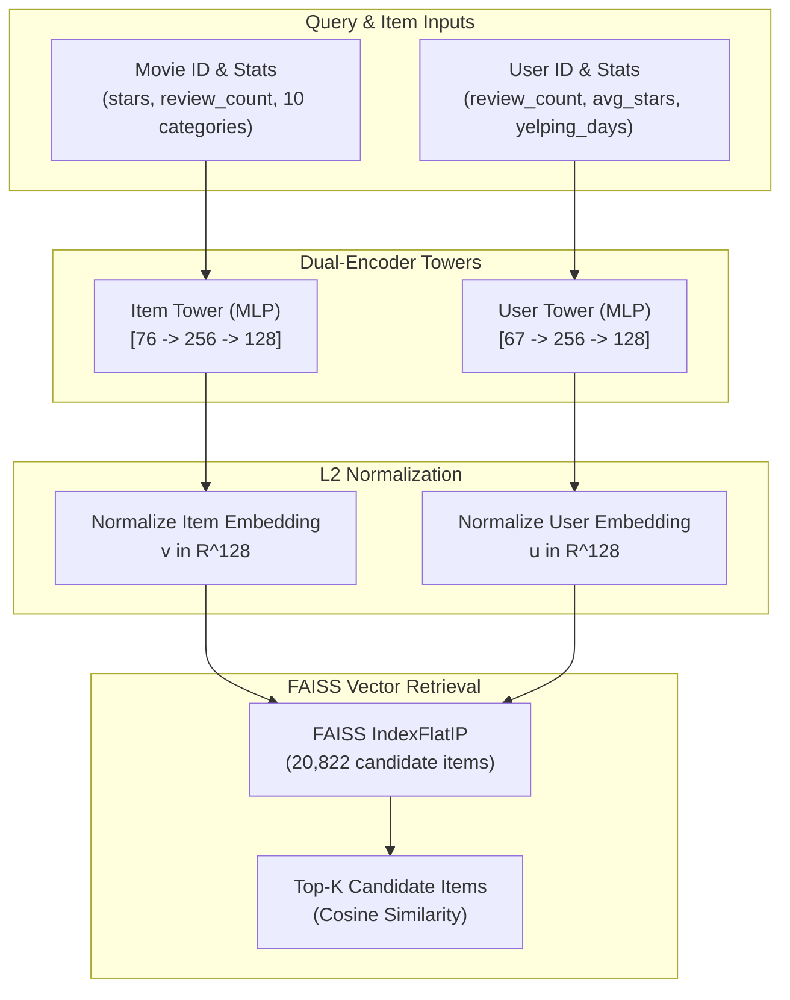
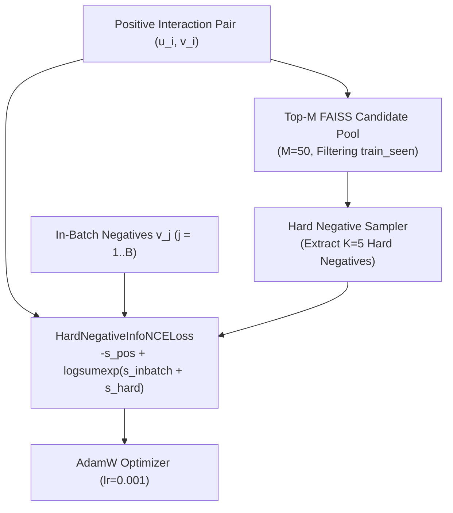

# Multimodal Two-Tower Product Recommendation System

[](https://www.python.org/)
[](https://pytorch.org/)
[](https://github.com/facebookresearch/faiss)
[](src/tests/)

A modular end-to-end implementation of a **Two-Tower Deep Learning Recommender System** integrated with **FAISS vector search** and evaluated on a warm-start **MovieLens benchmark** ($55,404$ warm-start users across $20,822$ candidate catalog items).

This repository contains the complete experimental pipeline: from raw interaction streaming, per-user chronological splitting, and TF-IDF/SVD title feature extraction, to **Hard-Negative InfoNCE contrastive training**, **Stage-2 MLP reranking**, and a controlled **6-model ablation study**.

---

## Overview

Modern large-scale recommender systems separate candidate retrieval into two distinct stages:
1. **Candidate Retrieval (Stage 1)**: Efficiently filtering millions of catalog items down to a relevant candidate subset (e.g., top-50) using dual-encoder neural networks (Two-Tower models) and approximate/exact vector similarity search (FAISS).
2. **Candidate Reranking (Stage 2)**: Scoring retrieved candidates with complex features and pairwise ranking objectives.

In this project, we systematically built, trained, and evaluated both stages. Through hypothesis-driven experimentation and a controlled 6-model ablation study, we empirically demonstrated that **single-stage FAISS retrieval using a Hard-Negative Two-Tower Retriever without text features** achieves the highest retrieval performance across all standard metrics (`Recall@10`, `Recall@50`, `NDCG@10`, `MRR@10`).

---

## Key Results

The table below summarizes the official benchmark performance across all 6 model configurations evaluated on the **MovieLens Warm-Start Test Set** ($55,404$ test users, $20,822$ candidate movies):

| Rank | Model Strategy / Architecture | Text Features | Loss Objective | Recall@10 | Recall@50 | NDCG@10 | MRR@10 | Selected Status |
| :---: | :--- | :---: | :---: | :---: | :---: | :---: | :---: | :---: |
| **1** | **Hard-Negative Two-Tower (No Text)** | **Disabled** | **Hard-Neg InfoNCE** | **0.011987** | **0.053355** | **0.005227** | 0.003248 | **FINAL SELECTED MODEL** |
| **2** | **Hard-Negative Content-Concat** | Concat (64-d) | Hard-Neg InfoNCE | 0.011900 | 0.053300 | 0.005200 | **0.003300** | Authoritative Baseline |
| **3** | **Original Two-Tower Baseline** | Disabled | In-Batch InfoNCE | 0.011500 | 0.051500 | 0.005000 | 0.003100 | Initial Baseline |
| **4** | **Content-Concat Two-Tower** | Concat (64-d) | In-Batch InfoNCE | 0.011000 | 0.052700 | 0.005000 | **0.003300** | Experimental |
| **5** | **Hard-Neg Concat + Stage-2 Reranker** | Concat (64-d) | Pairwise BPR | 0.010333 | 0.053252 | 0.004760 | 0.003114 | Negative Result |
| **6** | **Content-Gated Two-Tower** | Gated (64-d) | In-Batch InfoNCE | 0.010000 | 0.047400 | 0.004500 | 0.002900 | Negative Result |

*All metrics are reproduced from [`outputs/movielens/ablation_comparison.json`](outputs/movielens/ablation_comparison.json).*

---

## System Architecture

### Inference Pipeline



### Training Pipeline (Hard-Negative Mining)



---

## Why Two Towers?

Dual-encoder Two-Tower architectures offer essential computational advantages for candidate retrieval:
1. **Decoupled User and Item Inference**: User and item feature vectors are processed by independent neural networks (`UserTower` and `ItemTower`), producing 128-dimensional dense vector representations.
2. **Offline Item Precomputing**: All $20,822$ catalog item embeddings can be precomputed offline and indexed into a vector search engine.
3. **Sub-Millisecond Online Retrieval**: At query time, only the `UserTower` runs online inference ($< 0.1 \text{ ms}$). Nearest-neighbor search over precomputed item embeddings via FAISS returns candidates instantaneously.

---

## Dataset

- **Raw Dataset**: MovieLens Latest Dataset ($33\text{M}+$ ratings)
- **Processed Benchmark**: Warm-start subset containing $500,000$ interactions, $55,404$ unique warm-start users, and $20,822$ candidate catalog movies.
- **Split Strategy**: Per-user chronological split:
  - **Train**: $250,230$ interactions ($50\%$)
  - **Validation**: $61,547$ interactions ($25\%$)
  - **Test**: $61,547$ interactions ($25\%$)
- **Cold-Start Handling**: Cold-start users without prior training interactions were intentionally excluded from evaluation because this project specifically benchmarks warm-start retrieval performance.

---

## Data Leakage Prevention

Strict data boundary controls are maintained throughout data processing and model evaluation:
- **Chronological Split**: For every user, earlier interactions populate `train_interactions.csv`, middle interactions populate `valid_interactions.csv`, and the latest interactions populate `test_interactions.csv`. No future interaction is used to predict past behavior.
- **Seen-Item Candidate Filtering**: Training items (`train_seen`) are explicitly filtered out during validation and test retrieval evaluation using `filter_seen_candidates()`.
- **Zero Test Leakage**: Test interactions are never accessed during feature engineering, text SVD fitting, hard-negative sampling, or Stage-2 reranker training.

---

## Model Architecture

### `UserTower`
- **Inputs**: User ID (64-d embedding) $+$ User statistical features (`review_count`, `average_stars`, `yelping_days`, 3-d) $\to$ $67$-d vector.
- **MLP Layer**: Linear($67 \to 256$) $\to$ ReLU $\to$ Dropout(0.1) $\to$ Linear($256 \to 128$).
- **Output**: 128-dimensional user embedding $\mathbf{u} \in \mathbb{R}^{128}$.

### `ItemTower`
- **Inputs**: Item ID (64-d embedding) $+$ Item statistical features (`review_count`, `stars`, 2-d) $+$ Category features (10-d multi-hot) $\to$ $76$-d vector.
- **MLP Layer**: Linear($76 \to 256$) $\to$ ReLU $\to$ Dropout(0.1) $\to$ Linear($256 \to 128$).
- **Output**: 128-dimensional item embedding $\mathbf{v} \in \mathbb{R}^{128}$.

---

## Hard-Negative Mining

Standard in-batch InfoNCE contrastive training uses other items in the mini-batch as negative samples. In large catalog recommender systems, random in-batch negatives quickly become too easy for the model to distinguish.

To solve this, we implemented `HardNegativeSampler`:
1. For each user $u_i$ in mini-batch $B$, retrieve the top-$M$ ($M=50$) nearest candidate catalog items using current Two-Tower embeddings.
2. Filter out all items previously interacted with by user $u_i$ (`train_seen`) to enforce **zero false negatives**.
3. Uniformly sample $K_{\text{hard}}=5$ hard negative competitor items per positive interaction.
4. Evaluate `HardNegativeInfoNCELoss` using `torch.logsumexp` for numerical stability:
   $$\mathcal{L}_i = -s_{i, \text{pos}} + \text{logsumexp}\Big([s_{i, 1}, \dots, s_{i, B}, s_{i, 1}^{\text{hard}}, \dots, s_{i, K}^{\text{hard}}]\Big)$$

---

## Retrieval Engine (FAISS)

Candidate item retrieval is powered by FAISS (`faiss.IndexFlatIP`):
- Both user and item 128-d embeddings are **L2-normalized** prior to index building and search:
  $$\mathbf{u} \leftarrow \frac{\mathbf{u}}{\|\mathbf{u}\|_2}, \quad \mathbf{v} \leftarrow \frac{\mathbf{v}}{\|\mathbf{v}\|_2}$$
- Under L2 normalization, the vector inner product equals cosine similarity:
  $$\langle \mathbf{u}, \mathbf{v} \rangle = \cos(\mathbf{u}, \mathbf{v})$$
- Exact inner-product search (`IndexFlatIP`) computes exact top-$K$ cosine matches across all $20,822$ candidate items in sub-millisecond latency.

---

## Training Configuration

- **Optimizer**: AdamW ($\text{learning\_rate} = 0.001$, $\text{weight\_decay} = 0.01$)
- **Batch Size**: 256
- **Epochs**: 5
- **Temperature ($\tau$)**: 0.07
- **Device**: CPU
- **Checkpoints**: Saved per epoch to `checkpoints/movielens/`.

---

## Evaluation Metrics

Retrieval metrics are computed per user over all $20,822$ candidate movies after filtering out seen training items:
- **Recall@K**: Proportion of true test positive items retrieved in top-$K$.
- **NDCG@K**: Normalized Discounted Cumulative Gain accounting for rank positions of true positives.
- **MRR@K**: Mean Reciprocal Rank of the first true positive recommendation.

Ranking metrics provide a more meaningful evaluation for candidate retrieval than classification accuracy because recommender systems operate on top-$K$ ranked candidate lists.

---

## Ablation Study Summary

Our controlled 6-model ablation study yielded clear empirical classifications for each component:

1. **Hard-Negative Mining**: **BENEFICIAL** (+4.23% in Recall@10, +3.60% in Recall@50 over baseline).
2. **Title Text Features (TF-IDF + TruncatedSVD)**: **NEUTRAL** (+2.33% in Recall@50 under in-batch training; neutral under hard-negative mining).
3. **Learned Gated Fusion**: **HARMFUL** (-9.09% loss in Recall@10 due to optimization difficulty).
4. **Stage-2 MLP Reranking**: **HARMFUL** (-13.17% drop in Recall@10 due to global vector space distortion).

---

## Stage-2 Reranker Experiment

We evaluated a two-stage pipeline: Two-Tower Retrieval $\to$ FAISS Top-50 $\to$ Stage-2 MLP Reranker $\to$ Top-10.

The Stage-2 reranker trained a 33-d MLP on candidate pairwise features (similarities, interaction summaries, item stats) using pairwise BPR loss. While the loss converged cleanly ($0.3979 \to 0.0989$), offline evaluation revealed:
- `Recall@10` decreased from $0.011900 \to 0.010333$ (-13.17%)
- `NDCG@10` decreased from $0.005200 \to 0.004760$ (-8.46%)

**Conclusion**: The Two-Tower model trained with hard negatives develops global embedding space geometry. Reranking top-50 candidates on local feature diffs distorted intra-pool item ordering. Thus, the Stage-2 reranker was rejected for production.

---

## Reproducibility & Quickstart

### 1. Environment Setup

```bash
python -m venv .venv
.venv\Scripts\activate      # On Windows
pip install -r requirements.txt
```

### 2. Smoke Testing Commands

Run small-scale smoke training to verify the pipeline end-to-end:

```bash
# Smoke train Hard-Negative Model Without Text (1,000 samples)
python scripts/train_movielens.py --data-path data/processed/movielens --epochs 1 --batch-size 256 --device cpu --model-name smoke_hard_neg --use-hard-negatives --max-samples 1000

# Smoke train Stage-2 Reranker (1,000 samples)
python scripts/train_reranker.py --data-path data/processed/movielens --max-samples 1000 --epochs 1 --batch-size 128 --device cpu
```

### 3. Full Benchmark Benchmark Commands

```bash
# Train Final Authoritative Model (Model D: Hard-Negative Two-Tower Without Text)
python scripts/train_movielens.py --data-path data/processed/movielens --epochs 5 --batch-size 256 --device cpu --checkpoint-dir checkpoints/movielens --model-name hard_negative_no_text --fusion-type concat --use-hard-negatives --hard-negatives-per-positive 5 --candidate-pool-size 50

# Evaluate Single Model
python scripts/evaluate_movielens.py --data-path data/processed/movielens --checkpoint checkpoints/movielens/hard_negative_no_text_epoch_1.pt --device cpu --top-k 50

# Run Complete 6-Model Ablation Study Generator
python scripts/generate_ablation_study.py
```

---

## Testing

The test suite contains **53 unit tests** covering dataset preprocessing, feature shapes, FAISS search, loss gradients, negative samplers, reranker pipelines, and data leakage prevention:

```bash
.venv\Scripts\python.exe -m pytest -v
```

```text
======================= 53 passed, 5 warnings in 9.86s =======================
```

---

## Repository Structure

```text
multimodal-product-recommender/
├── data/
│   └── processed/movielens/     # Preprocessed MovieLens data files
├── docs/
│   ├── results.md               # Detailed ablation comparison table
│   └── experiments.md           # Research log & experimental progression
├── outputs/
│   └── movielens/
│       ├── ablation_comparison.json
│       ├── ablation_report.md
│       ├── reranker_comparison.json
│       └── hard_negative_comparison.json
├── scripts/
│   ├── prepare_movielens.py     # Dataset preprocessing script
│   ├── train_movielens.py       # Two-Tower model training CLI script
│   ├── evaluate_movielens.py    # Offline FAISS evaluation CLI script
│   ├── train_reranker.py        # Stage-2 Reranker training CLI script
│   ├── evaluate_reranker.py     # Stage-2 Reranker evaluation script
│   ├── generate_ablation_study.py
│   ├── generate_fusion_comparison.py
│   └── generate_hard_negative_comparison.py
├── src/
│   ├── data/                    # Dataset loaders & stream preprocessing
│   ├── features/                # TF-IDF + TruncatedSVD text embedder
│   ├── models/                  # Two-Tower & Stage-2 Reranker modules
│   │   └── towers/              # UserTower & ItemTower neural layers
│   ├── retrieval/               # FAISS index wrapper & retrieval pipelines
│   ├── tests/                   # PyTest suite (53 unit tests)
│   ├── trainers/                # PyTorch training loop handlers
│   ├── training/                # Hard & Random negative sampling modules
│   └── utils/                   # Config, losses, metrics, & model utils
├── README.md
├── pytest.ini
└── requirements.txt
```

---

## Limitations

- **Benchmark Constraints**: Evaluated on MovieLens warm-start interactions rather than live production click-through traffic.
- **Warm-Start Evaluation**: Cold-start users were excluded from evaluation metrics to focus on warm-start retrieval quality.
- **Dataset Scale**: Benchmarked on a 500,000 interaction sample ($55,404$ test users, $20,822$ catalog items).
- **Text Feature Expressiveness**: Title text features were limited to TF-IDF + TruncatedSVD (64 components) rather than large transformer LLM embeddings.
- **FAISS Search Mode**: Used exact inner-product search (`IndexFlatIP`) rather than approximate nearest-neighbor indexing (IVF/HNSW).

---

## Future Work

- **Richer Content Modalities**: Incorporating pre-computed visual embeddings from movie poster images.
- **Approximate Nearest Neighbor Indexing**: Testing FAISS HNSW / IVF-PQ indices for catalog scales exceeding 10M items.
- **Sequential User Dynamics**: Extending `UserTower` with Transformer/GRU layers to capture sequential user interaction histories.
- **Transformer Text Encoders**: Evaluating domain-tuned Sentence-BERT text embeddings for cold-start item generalization.

---

## License

This project is licensed under the **MIT License**.
